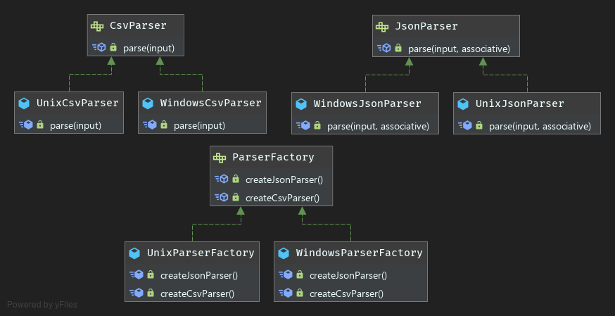

# Abstract Factory

**Definition**
```
The essence of the Abstract Factory Pattern is to 
"Provide an interface for creating families of related or dependent objects without specifying their concrete classes."
```

- Abstract Factory lets you produce families of related objects without specifying their concrete classes.
- The client code has no knowledge whatsoever of the concrete type, not needing to include any header files or class declarations related to it. 
- The client code deals only with the abstract type. 
- Objects of a concrete type are indeed created by the factory, but the client code accesses such objects only through their abstract interface.

**Abstract Factory Pattern vs Factory Method Pattern**
- Abstract factory adds another level of abstraction to factory method. While factory method abstracts the way objects 
  are created, abstract factory abstracts how the factories are created. The factories in turn abstracts the way objects 
  are created. The abstract factory design pattern is referred to as a "factory of factories".
- From implementation point of view, the key difference between the factory method and abstract factory patterns is that
  factory method is just a method to create objects of a single type, while abstract factory is an object to create families of objects.
- Another difference is that the factory method pattern uses inheritance while the abstract factory pattern uses composition. 
  We say that that factory method uses inheritance because this pattern relies on a subclass for the required object instantiation.

### UML

